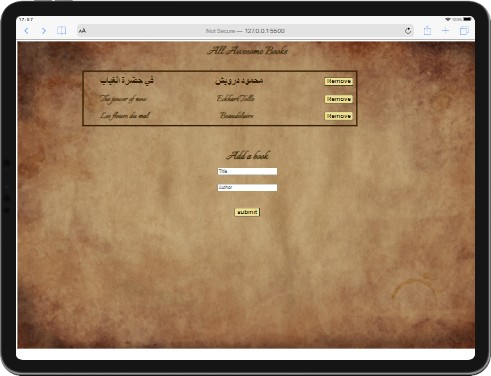

# Awesome-books

> This project consists on Building a basic website that allows users to add/remove books from a list.

## Built With

- HTML
- Javascript
- VScode

## Getting Started

To get a local copy just download the repository ZIP, UNZIP then open the Index.html file.

## Author 

👤**Amel Khiri**

- GitHub: [@Algerina](https://github.com/Algerina)
- LinkedIn: [@Amel Khiri](https://linkedin.com/in/amel-khiri-qahwadji-37a550135)

## 🤝 Contributing

Contributions, issues, and feature requests are welcome!

## Show your support

Give a ⭐️ if you like this project!

## Acknowledgments

- Hat tip to anyone whose code was used
- Figma

## 📝 License

This project is [MIT](./MIT.md) licensed.